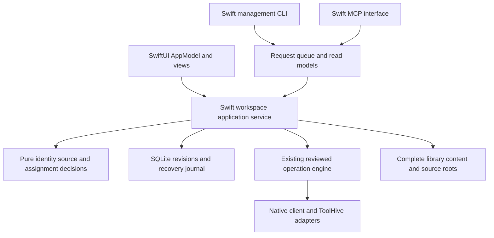

# Agent Tooling delivery and delegation plan

Status: implementation in progress; the [progress ledger](implementation-progress-2026-09.md) records acceptance evidence and remaining work. The [implementation plan](implementation-plan-2026-09.md) owns the product, source-of-truth, migration and compatibility contracts. This document turns those contracts into bounded work and model assignments. It does not authorize a product migration, background automation, commit or publication.

## 1. Working decisions

- Keep all application/domain implementation in Swift, including the shared Core service, merge logic, source readers, app, management CLI and MCP interface. SwiftUI/AppKit remain the desktop UI. Use existing SQLite/Git/native-client/runtime integrations.
- Deliver the central-library and assignment flow before the complete sync/settings/runtime roadmap. Each milestone must work without unfinished later screens.
- Use smaller models for most bounded work. Model routing is a starting hypothesis to validate on accepted patches, not a claim that every small model performs equally on this repository.
- Use a single integration owner for shared domain contracts, migrations and the working build. Parallelize independent modules and evidence gathering after contracts are stable.
- Preserve the existing dirty worktree. Do not create a clean-HEAD branch and accidentally omit the ongoing product work.

## 2. What delegation was actually verified

The current collaboration tool advertises GPT-5.6 Luna, Terra and Sol alongside larger models. During this planning pass:

| Worker | Explicit settings | Completed work |
| --- | --- | --- |
| `workspace_model_check` | `gpt-5.6-luna`, medium reasoning, fresh bounded context | Verified Skills Manager's linked-workspace/preset semantics; then reviewed the existing Swift Core/app/CLI/MCP service boundaries |
| `plugin_spec_audit` | `gpt-5.6-sol`, medium reasoning, fresh bounded context | Compared existing package/MCP implementation with Agent Plugins 1.0; identified concrete conformance, compatibility and central-storage gaps |

The package audit also ran `swift test --filter 'PackageContractTests|AgentPluginMCPModelsTests'`: five existing tests passed. This is narrow baseline evidence, not full conformance, a performance benchmark or a product-change validation.

A third worker attempt using Terra encountered the current agent-thread limit and did not run. This session therefore proves useful two-worker parallelism, not unlimited fan-out or a tested Terra implementation lane. Start with two workers plus the coordinator. Add another only when actual capacity and independent work permit it; do not bypass the limit with hidden CLI agent processes.

The local Codex CLI is version 0.153.4 and exposes model/config overrides, working-directory selection, structured output and JSON events. That provides an optional future reproducible job runner. It was inspected, not used to launch implementation agents, and no global model configuration was changed. Prefer the collaboration tools for this task: they already expose explicit model selection, bounded context, messages and results.

Worker model choice does not change the model already running the coordinator's task. Future implementation can use Sol as coordinator if selected by the user, while delegating most work to Terra/Luna. No per-model prices, dollar savings or account-specific speed guarantees were measured here.

## 3. Model routing

| Work | Default model / reasoning | Review and escalation |
| --- | --- | --- |
| Narrow source inventory, compatibility tables, fixture inventory, documentation and simple isolated UI changes | Luna / medium | Coordinator checks outputs against source and rendered behavior; do not delegate ambiguous migrations as simple cleanup |
| Pure parsers/resolvers, indexed presentation models, assignment UI against stable interfaces, ordinary bounded Swift implementation | Terra / medium | Focused tests and an independent contract review; first pilot validates whether this lane is productive here |
| Service integration, native adapter changes, filesystem boundaries, central-content updates and larger Swift refactors | Sol / medium | Independent review for overwrite/identity/ownership effects; escalate a specific unresolved issue rather than the whole phase |
| Migration design, concurrent merge decisions, filesystem/DB crash recovery and native configuration writes | Sol / high for design/review; implementation split into bounded Terra/Sol packets | Request targeted Astra / high review only if evidence shows unresolved complexity or repeated failure |
| Routine final integration, docs and result reporting | Sol / medium | Full required gates once per integrated batch |

Ultra is not a default lane. There is no reason to spend premium reasoning on renaming fields, building a fixture table or styling a known component. Conversely, assigning data-loss-sensitive logic to the smallest model and then repeatedly repairing it is not necessarily cheaper.

Use one focused corrective attempt when an implementation misses a known contract. If a second attempt still fails, or the contract itself is unclear, stop that packet and escalate its precise failing scenario. Migrations, path containment, concurrency and native trust issues can escalate immediately. Record why escalation occurred so the next packet is scoped better.

## 4. Architecture boundaries before parallel coding

Keep the existing package products. Strengthen the Swift Core library rather than creating a new backend:



The request arrow is not authority to apply: MCP retains its queue-only boundary. CLI request submission uses the same review path. The trusted coordinator prepares a plan against current state and applies through the existing reviewed executor. A future local operator or phone approval API is a separate authenticated surface.

The first contract packet must settle:

1. Stable IDs, parent-package identity and external aliases.
2. Personal central, upstream central, native-owned, attached-authoring and unresolved/tracked modes.
3. Portable records versus device-local paths, credentials, receipts and observations.
4. Assignment intent/reasons, target capabilities, preset application receipts and legacy resolver semantics.
5. Command/result types, expected workspace revision, idempotency and writer ownership.
6. Package diagnostic scopes and supported Agent Plugins/client-version matrix.

Workers may propose contract changes; they do not each invent a different implementation of these types. Accept interface changes centrally before dependent work continues.

## 5. Tickets and dependency order

These IDs are planning IDs, not created GitHub issues. Paths are proposed file ownership under `apps/agent-tooling-macos` unless identified as existing integration points. Exact test names are chosen when each packet is started, after inspecting the package.

| Ticket | Deliverable and main ownership | Depends on | Default lane | Acceptance |
| --- | --- | --- | --- | --- |
| F0 | Baseline fixture inventory, read-only ownership/target matrix, current Release interaction measurements | None | Luna evidence + coordinator measurement | Central personal, upstream, native child, unknown, legacy profiles and external edits represented; no real client writes |
| F1 | Domain contracts and third-party reuse register | F0 | Sol | One authority/identity/assignment model; exact upstream revisions/licenses; parallel interfaces approved |
| D1 | `ArtifactIdentity`, `ContentAuthority`, `SourceRootBinding`, `PortableWorkspaceDocument`, `DeviceWorkspaceState` and encoding tests | F1 | Terra | Stable identity through rename; portable output has all referenced artifacts and excludes device-only fields |
| D2 | Versioned store migration, legacy alias mapping, old/new resolver comparison and rollback receipt | D1 | Sol, exclusive store owner | Dry-run preserves all references and legacy nil/empty semantics; native files unchanged; unsupported writer blocked |
| D3 | `WorkspaceApplicationService` command/result APIs and transactional writer coordination | D1; integrate with D2 | Sol | UI no longer owns new mutation logic; stale revisions/replayed requests cannot overwrite newer state |
| S1 | Versioned Vercel/global/project lock readers and evidence fixtures | F1/D1 | Terra | Real field/digest schemas, XDG paths, unsupported versions and name-only ambiguity covered; reads do not rewrite locks |
| S2 | Git checkout/worktree/source evidence resolver and source review read model | D1/S1 | Terra | Confirmed binding preserved; conflicts shown; one source fetch can serve many skills |
| S3 | Central personal/upstream content store and complete-tree staged updates | D2/D3/S2 | Sol | Publisher identity/lock retained; central update reconciles reviewed destinations; modified deployments survive |
| S4a | Advanced attached authoring roots and source-role bindings | D1/D3/S3 | Terra | Source remains the only editable authority; unpublished edits intact; no silent write-back or competing library master |
| S4b | Linked external destination bindings | D1/D3/A1 | Separate Terra packet | No-clobber one-time assignment, device-local target identity and receipt-backed removal; destination never implicitly becomes an authored source |
| AP1 | Exact Swift manifest decoding/diagnostics and fixture cases | F1 | Terra with Sol contract review | Nonfatal exceptions, strict nested fields and unimplemented extensions handled according to spec |
| AP2 | Filesystem-aware discovery and component isolation | AP1 | Sol | Root/symlink bounds, path kinds, manifest/MCP version mismatch and invalid sibling scenarios covered |
| AP3 | Per-client component compatibility and format/source UI distinction | AP2/D1 | Terra | No blanket all-client claim; supported component/transport explicit; format is not a marketplace |
| AP4 | Whole-package preservation through intake/staging/export primitives | AP2/D1/S3 | Terra | Native adapters, extension/resource files and complete package identity preserved; standalone wrappers never replace a native parent |
| A1 | `AssignmentResolver`, contribution/receipt model and target-capability decisions | D1/D3 | Terra with Sol integration | Manual/preset/plugin reasons deterministic; one physical destination receives one planned write |
| A2 | Shared assignment sheet and indexed result model; integrate Library and one Project entry point first | A1 interface stable | Terra | Select items/targets/apply once; inherited children stay bundled; readable partial results and retry |
| A3 | Native planner integration, onboarding, remaining entry points and Apply-once presets | S3/AP3/AP4/A1/A2 | Sol integration + bounded Terra UI packet | Same service across views; onboarding doesn't enable/remove unselected items; native packages remain intact |
| V1 | First end-to-end packaged-app pilot | D2–D3/S3/S4a/S4b/AP3/AP4/A3 | Coordinator | Central personal + central upstream + whole plugin + attached source + project work after reopen; linked destination Apply once preserves pre-existing files and its destination role; required invocation checks pass |
| Y1 | Pure `WorkspaceMergeEngine` and base/local/remote Swift fixture suite | D1/A1 | Terra implementation + Sol/high review | Field merges, tombstones, ownership conflicts, clock skew and missing ancestry deterministic |
| Y2 | Revision store, outbox, filesystem/DB journal and crash recovery | D2/D3/S3 | Sol/high design, bounded Sol implementation | Crash injection recovers; captured-revision acknowledgment cannot clear newer edits |
| Y3 | `GitWorkspaceTransport`, enrollment and background scheduler | Y1/Y2 | Terra + Sol integration | No live DB transport; expected-head handling; remote-only idle updates; no force push or unrelated source commits |
| Y4 | Devices/conflicts/restore UI and real two-Mac pilot | Y1–Y3 | Terra UI + coordinator pilot | Conflict publication policy honored; restored state is a new revision; native deployment status separate |
| C1 | Versioned Codex and Claude effective-setting resolvers and compatibility register | F1/D1 | Separate Terra packets by adapter | Precedence/policy/session limits accurate; unknown fields visible; inspector writes nothing |
| C2 | Effective-settings inspector in Apps/Projects | C1 | Terra | Value, source, override, writable layer and new-session requirement readable |
| H1 | ToolHive provider discovery/version/status and bounded cancellable log stream | D3 contract | Terra | Unavailable/version mismatch useful; bounded memory/log work; no false runtime health claim |
| H2 | Reviewed ToolHive start/stop/restart adapters and postconditions | H1/D3 | Sol | Idempotent/recoverable outcomes; unrelated workloads preserved; upgrade/delete remain gated |
| AP5 | Portable MCP-to-native/runtime mapping and conformance fixtures | AP2/AP3/D3; H1 only for ToolHive-backed route | Sol | Declared transport, persistent package data and supported variable/environment semantics tested; unsupported routes explicit |
| E1 | Narrow native settings editors, then hooks/agents/instructions one adapter/event at a time | C1/C2/D3 | Terra + Sol write-path review | External edits/unknown fields/native trust preserved; no speculative cross-vendor translation |
| P1 | Explicit versioned linked-preset subscriptions and additive project declaration/lock writer | A1/Y1/Y2 | Terra | Removing one contribution preserves manual/other-preset requirements; no silent legacy behavior change; earlier Apply-once behavior remains independent of sync |
| X1 | Full-folder export and target compatibility report | AP3/AP4/S3 | Terra | Resources preserved; native/remote dependencies explained; cloud upload contract verified at implementation |
| X2 | Expanded management CLI/MCP requests, optional Mini access and encrypted-folder transport, each separate batch | V1/Y4; operation-specific prerequisites | Sol design + Terra packets | Shared services reused; same merge cases; device credentials local; no implicit agent self-approval |

Do not run all these tickets at once. The first funded implementation milestone should be F0 through V1. Y1 can start once its pure contracts stabilize, but full sync waits for storage, ownership and assignment behavior to be proven.

An external linked destination with an Apply-once preset is delivered by S4b/A1–A3 before sync. P1 is the later opt-in subscription to future preset membership changes; it needs revision/merge semantics. Do not couple these two meanings of “linked.”

## 6. Practical parallel waves

| Wave | Worker A | Worker B | Coordinator |
| --- | --- | --- | --- |
| Baseline | Capture source/legacy fixtures | Agent Plugins schema/compatibility fixtures | Measure packaged UI; freeze F1 contracts |
| Foundations | D1 portable encoding/types | AP1 diagnostics after contract freeze | Own D2/D3 storage/service integration |
| Sources | S1/S2 readers and evidence | A1 resolver, then A2 sheet against frozen interface | Integrate S3 central content; review ownership |
| First useful release | AP2–AP4 package compatibility/preservation, then S4a | A2/A3 bounded UI entry points, then S4b | Native planners, migration preview and V1 pilot |
| Synchronization | Y1 pure merge fixtures/decisions | C1 settings adapter or H1 read-only runtime, one at a time | Y2 recovery, then Y3 integration |
| Finish sync | Y4 conflicts/device UI | C2 inspector or H1, whichever remains | Real two-Mac convergence/recovery pilot |
| Expansion | One editor/export packet | One unrelated runtime/CLI packet | Integrate, validate, keep scope within demonstrated adapters |

This is a dependency graph with checkpoints, not eight autonomous agents modifying a shared store. The UI can advance using fixture-backed view models while services are built, but mock success must not become product behavior or be counted as an end-to-end completion.

## 7. File ownership and dirty-worktree continuity

Before coding, capture the exact base SHA, `git status`, tracked diff and a manifest of relevant untracked source files. The current worktree contains extensive earlier UI/onboarding/performance changes. An isolated checkout from HEAD alone would omit them. Keep the baseline snapshot local; do not create an unsolicited checkpoint commit.

Default to the shared working tree with exclusive file assignments. Each packet gets an allowlist of new/existing files. Treat these as single-owner integration points unless explicitly handed off:

- `Models.swift`, `WorkspaceStore.swift` and schema/migration numbering.
- `AppModel.swift`, `WorkspaceLibrary.swift`, `OperationEngine.swift` and shared plan types.
- `Package.swift`, shared fixtures and application-wide theme/navigation contracts.

Prefer new narrow files for parallel work; the coordinator performs the few shared-file wiring edits. A worker needing a shared change sends an interface proposal and pauses only the dependent portion. Two workers must not each edit the same migration or invent different authority enums.

Use isolated working copies only when larger tasks need independent builds. Seed them from a reviewed snapshot of the current tracked and relevant untracked work, exclude credentials/runtime data, and return a scoped diff relative to that snapshot. Do not describe uncommitted changes as cherry-pickable commits. Actual Git worktrees become convenient after an explicitly authorized committed baseline exists.

Only one integration build runs against the mutable shared package at a time. Workers can run focused checks when their dependencies are stable and the build slot is free, or in a deliberately isolated copy. Do not run multiple full Swift builds or performance measurements while other agents are modifying dependencies. Run rendered UI/performance checks after the wave settles.

## 8. Work-packet template

Each assignment should fit in a short fresh-context prompt plus the relevant contract excerpts:

```text
Objective: one observable outcome, with a ticket ID.
Context: exact worktree, baseline, relevant AGENTS.md and architecture contract.
Inputs: exact source/fixture paths and pinned upstream references.
Allowed changes: exclusive files or proposed new module; shared files owned elsewhere.
Behavior: input/output contract, supported cases and deliberately unsupported cases.
Acceptance: a small set of meaningful scenarios and the applicable focused test command.
Constraints: no real client/source migration, no global config edits, no commit/push.
Escalate: conflicting contract, unexpected external edit, or a destructive/concurrency ambiguity.
Return: changed files, behavior, test evidence, unresolved issues and integration notes.
```

Use fresh context for a bounded module instead of copying the whole UI/history conversation into every worker. Give enough domain constraints to prevent “copy all skills” regressions. Follow up within a worker for adjacent work when its context remains small and relevant; start fresh for a different subsystem. Retrieve result summaries and exact failing evidence, not repeated full tool logs.

## 9. Acceptance, reviews and efficiency measurement

An implementation ticket is complete when its behavior and integration gate pass, not when a worker reports that it wrote code. For each batch:

1. Review the diff against the approved contract and current baseline.
2. Run focused semantic tests for the changed logic. Avoid tests that merely duplicate implementation branches.
3. Integrate once, then run the package's relevant required checks. Re-run broader checks only after changes or unresolved failures justify it.
4. For UI behavior, inspect the packaged app: scrolling, tab changes, selection and target context. Measure latency in Release on a quiet machine with a recorded fixture size.
5. For native delivery, retain manifest validation, isolated marketplace/client install smoke checks and explicit/implicit invocation tests required by `AGENTS.md`.
6. For sync, require an actual two-Mac pilot in addition to isolated merge tests. Record local/native/remote coverage separately.

Keep a lightweight per-packet ledger: ticket, model/reasoning, elapsed time, available usage data, retries, review findings, accepted scope and remaining risk. Compare cost per accepted result and rework, not just first response speed. Tool registry availability is not an empirical benchmark, and account usage percentages do not establish per-agent dollar cost.

Use two representative pilots to calibrate the routing: a versioned source-lock reader with adversarial fixtures for Terra, and a small assignment result view for Luna/Terra. Keep migration/journal design with Sol until the lower-cost lane demonstrates reliable results. If a model repeatedly needs extensive repair in one category, route that category upward while retaining smaller models for independent fixture/data/UI work.

## 10. Definition of the first milestone

The first milestone is successful when a user can add a personal skill or a GitHub standalone skill to the central library, select apps/project, apply a preset or batch, and see a clear result; subsequent upstream updates retain provenance and preserve modifications. Existing native plugins remain whole. Existing authoring repositories can remain attached. Onboarding and ordinary assignment use the same model, and lists stay responsive.

Everything else builds on that contract: two-Mac sync, settings inspection, runtime depth, narrow editors, exports and optional phone access. This sequencing gives the app a simpler usable core before expanding its management surface.
