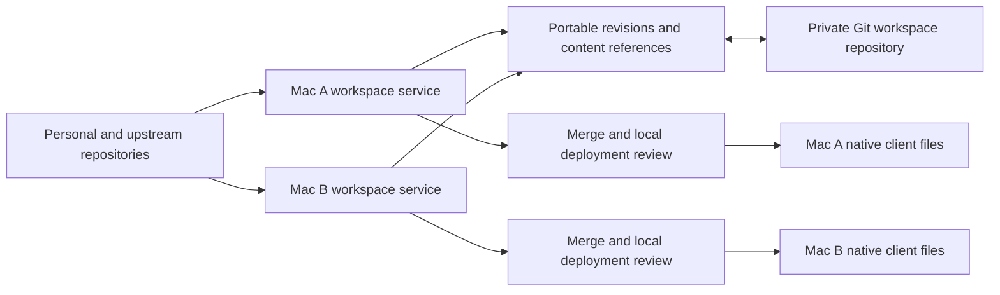

# Agent Tooling implementation plan

Status: implementation in progress under an active goal; [the progress ledger](implementation-progress-2026-09.md) records current completion and validation boundaries. Reviewed September 8, 2026 against the current worktree based on `fe36b65735444ab29b783ba2c1892fbb911b87f8`, including its existing uncommitted changes. This document supersedes the sequencing in the earlier [onboarding roadmap](onboarding-feature-roadmap.md); that document remains useful historical context. The [competitor review](competitor-review-2026-09.md) records the inspected upstream revisions and evidence boundaries.

Updated decisions: central-library management is the default for personal and upstream standalone skills; native plugins remain intact under their native owner; attached authoring repositories are an optional advanced workflow. All new application and domain implementation stays in Swift. The [delivery plan](implementation-delivery-2026-09.md) defines smaller-model assignments, parallel work boundaries and acceptance gates.

## 1. Product decision

Keep building Agent Tooling as a coherent manager for the actual Claude/Codex setup: personal skills, upstream subscriptions, intact plugins, MCP connections, project assignments and native configuration. Make the ordinary skill workflow as straightforward as Skills Manager before expanding the surface area.

The major work is a domain-model and workflow change, followed by real synchronization. Retain SwiftUI, the native sidebar/materials, current indexed inventory, native adapters, SQLite persistence, and the reviewed operation/recovery engine. Keep the UI, shared application service, source/update logic, merge engine, CLI and MCP integration in Swift. Do not add a Rust helper, FFI bridge, Tauri backend or rewrite milestone. Supported external programs such as Git and ToolHive remain integrations; they are not a second application backend.

Recommended decisions:

1. **Make the central library the default.** Personal standalone skills have one editable library source. Upstream standalone skills have a complete library version tied to their publisher, approved revision and update route. Native plugins retain their native owner. Existing authoring repositories can remain attached for direct editing without creating another editable source.
2. **Separate portable intent from device observations.** The shared library describes what an item is, where it comes from and where it should be available. Each Mac records what is actually installed, its local paths and credentials, and which changes have been approved/applied there.
3. **Use one assignment service and editor everywhere.** Library, Projects, presets, onboarding, CLI and MCP should produce the same assignment intent and reviewable plan.
4. **Ship Git-backed workspace synchronization first.** Use a dedicated private workspace repository by default. Keep Git optional for local use. Reuse the same object merge engine for encrypted-folder synchronization later; the current archive remains backup/restore.
5. **Inspect effective native settings before editing them.** Resolve values with their source, overrides, policy and client-version context. Preserve native formats for hooks, agents and settings.
6. **Extend ToolHive instead of building another MCP process/container supervisor.** Add truthful runtime visibility first, then a bounded set of reviewed actions.
7. **Use Agent Plugins for portable packages.** Finish package-loader conformance for supported components, document the supported delivery profile, retain client-native adapters, and keep package format separate from source ownership, assignment and device synchronization.

The intended advantage over Skills Manager is complete package and client context: “I can understand and maintain my setup without accidentally forking a vendor skill, stripping a plugin’s dependencies, or confusing an installed declaration with a usable connection.” That advantage still needs to be demonstrated in the finished workflow.

## 2. Current foundations and gaps

| Area | Foundation to retain | Required change |
| --- | --- | --- |
| Content | `WorkspaceLibrary` stages complete managed skill trees with bounded path/fingerprint checks; onboarding tracks existing standalone skills by default | Centralize new personal/upstream intake with explicit authority; retain tracking-only discovery and optional attached authoring roots; validate every supported package component |
| Portable packages | Agent Plugins 1.0 manifest/MCP models, package inspection and draft generation already exist | Close loader/runtime conformance gaps and expose tested compatibility without treating a format as a marketplace |
| Sources | `SkillRepositoryBinding` records URL/ref/subdirectory and reviewed update baselines | Split portable subscription/lock from local paths, installed fingerprints and check results; automatically discover provenance |
| Identity | Existing skill, plugin, profile and collection records | Persist stable IDs independent of names, paths and client labels; migrate every reference together |
| Assignments | Profiles, target bindings, native operation builders | Model explicit destinations, reasons for assignment, package inheritance and per-target outcomes; current ordinary sync is not a universal plugin/MCP installer |
| Persistence | SQLite transactions and a cross-process pending-request transaction | Add portable document, device state, revisions/conflicts and recovery journal; one writer contract for filesystem and metadata |
| Sync | Backups, encrypted archives and reviewed restores | Common ancestry, object-level merge, deletion history, enrollment, background fetch and recovery |
| Settings | User configuration discovery and project file inventory | Effective-value resolution, override explanation and installed-version support matrix |
| MCP | Live inventory/test sessions and optional ToolHive version/list adapter | Runtime state/log streaming and typed reviewed lifecycle plans |
| Agent control | Shared core package, CLI and read/request MCP tools | Extract application services out of UI-oriented orchestration; retain one mutation authority |
| Performance | Cached presentation indexes, background scans and Release packaging | Keep new source checks, merge work, settings resolution and logs away from rendering; qualify real interactions |

One concrete portability defect must be addressed before sync: the current portable snapshot filters skills to `owned` and removes plugins. Upstream standalone subscriptions can disappear while profiles or collections retain references to those items. A portable schema must encode source intent and native package references explicitly instead of exporting a filtered inventory snapshot. See [WorkspaceSnapshotValidator](../apps/agent-tooling-macos/Sources/AgentToolingCore/WorkspaceSnapshotValidator.swift), [SkillRepositoryModels](../apps/agent-tooling-macos/Sources/AgentToolingCore/SkillRepositoryModels.swift), and [EncryptedSyncService](../apps/agent-tooling-macos/Sources/AgentToolingCore/EncryptedSyncService.swift).

## 3. What is the source of truth?

There are different authorities for content, desired assignments and actual runtime state. Making them explicit avoids treating one directory or database as authoritative for everything.

| Item | Content authority | What Agent Tooling owns | Update/edit behavior |
| --- | --- | --- | --- |
| Personal standalone skill — default | One editable package in the central library | Content, identity, assignments and revision history | Create/edit there; deploy derived links/copies as required by each client |
| Third-party standalone skill — default | Publisher owns future releases; the approved library content revision supplies local deployments | Complete source-linked library content, subscription, approved immutable revision, assignments and installation records | Fetch/stage updates into the library, compare baselines and review affected targets; editing as personal content requires an explicit fork |
| Native plugin, including official bundles | Native client/marketplace package | Optional tracking and supported desired presence/availability | Use native package install/update routes; children remain part of that package |
| Attached authoring repository — advanced | Existing self-contained source root, including this repository's `plugins/<plugin>/skills/<skill>/` | Source registration, portable identity, assignments and local deployment baselines | Edit the registered source in place; retain native manifests and the repository's publishing workflow |
| Unknown existing skill | Its current external source until resolved | Observation and any explicit tracking decision | Explain uncertainty; offer source recognition or an explicit personal-source registration |
| MCP connection | Explicitly declared personal definition or its native/plugin owner | Portable intent where supported, local binding and status | Credentials and machine commands remain local or use explicit local overrides |
| Effective client settings | Native configuration layers, administrative policy and known session overrides | Explanation and reviewed edits to supported writable layers | Never substitute desired state for evidence of effective state |

**Installation copies and caches are allowed. They are not personal forks.** A copied third-party package remains upstream-maintained when its source, selected revision and update route remain attached. A personal fork is a separate action that creates a new artifact identity with `derivedFrom` provenance.

The everyday model is **Library → Assign → Apps/projects**. The library is the canonical catalog and approved deployment content for managed standalone skills. Publisher repositories supply upstream releases; native clients own installed native packages. SQLite stores the portable identities/intent plus separate device records, not the only copy of skill text. Client folders are deployment destinations, not competing editable library masters.

This follows Skills Manager's central source/deployment separation. It also has linked workspaces for arbitrary external roots: those roots are excluded from global preset synchronization, while its workspace UI can apply a preset once. Our advanced attached-authoring-root option and our destination/workspace option must be independent concepts. An external directory can be an editable source, a deployment destination, or an inventoried location; the UI must say which. [Skills Manager workspace features](https://github.com/xingkongliang/skills-manager/blob/10476370f6a57bdb551be328761eabbfa5d17f6c/README.md), [linked workspace implementation](https://github.com/xingkongliang/skills-manager/blob/10476370f6a57bdb551be328761eabbfa5d17f6c/src-tauri/src/commands/projects.rs).

Do not move existing source files merely to normalize folder layout. Introduce a source-root abstraction that can resolve both the current `library/packages` roots and repository packages. Existing repository skills continue to have exactly one authored physical copy at the path required by `AGENTS.md`. Staging directories, backups and client installation copies are derived data.

For new intake, offer **Add to library**; recognized upstream sources stay source-linked automatically. For already discovered files, first preserve their current state and show a migration preview: manage in the library, attach an authoring root, or track only. Taking an existing personal source into the central library requires choosing the new editable authority and dealing with original destinations explicitly; do not leave two silently competing editable masters. Unselected items and client-owned caches are never relocated by onboarding. Centralize a complete standalone skill folder, including references/scripts/assets; do not extract an individual child from a native plugin to satisfy this default.

### Local storage and portable representation

Keep SQLite as the durable local store for catalog metadata, portable intent, revisions and device records. A new `PortableWorkspaceDocument` is the versioned serialization/merge contract for the shared subset. It is committed transactionally through a shared workspace service and serialized deterministically for transport. Transport JSON files are not a second independently writable local database.

For central personal skills, the central package is the authored source. For attached authoring repositories, files in the registered root remain authoritative. Edits to either trigger validation and a new local content revision. For upstream skills, the approved central snapshot supplies deployments while the publisher owns future releases; unexpected local changes require review, not an implicit authorship change. A filesystem/metadata journal records staged content, expected fingerprints, accepted revision and database projection so a crash cannot silently pair new metadata with old content. SQLite transactions alone do not make filesystem changes atomic.

Default Git transport uses a dedicated repository containing stable-ID metadata and central personal package snapshots. Source-linked third-party content is materialized in each Mac's central library from the shared approved lock; the default transport carries that lock and provenance, avoiding a second upstream publishing workflow. Keep verified revisions locally for offline use and restore. If a locked revision cannot be fetched on a joining Mac, report missing content and preserve the accepted lock; do not silently substitute a branch tip. Optional transport of complete upstream snapshots can follow with an explicit retention/distribution policy. Attached personal repositories retain their own publishing workflow. Do not place workspace sync metadata into this app’s code repository by default or auto-commit unrelated working-tree changes.

An existing personal repository can be checked out once on each Mac and registered to the same logical source. Its authored bytes travel through that repository’s own Git workflow. Until local source edits are published there, other Macs remain on the last available source revision and the app shows “Local source changes not published.” Workspace sync must not imply that it published a personal repository. A later explicit source-publish workflow can handle that separately.

### Proposed model contracts

Names below are proposed types, not existing implementation claims.

| Type | Key fields / responsibility |
| --- | --- |
| `Artifact` | Stable UUID, kind, declared name, display name, authority, parent package ID, legacy aliases |
| `SourceDescriptor` | Stable source UUID, repository/catalog locator, publisher evidence, relative content root; no machine path |
| `SourceSubscription` | Source ID, subdirectory, requested ref/update policy, approved lock containing commit OID and typed content digest |
| `ContentRevision` | Artifact/source identity, immutable revision and complete content tree digest; scripts/references/assets included |
| `SourceRootBinding` | Device-local mapping to central content, an attached editable repository or a tracked external root; role and write ownership are explicit |
| `Assignment` | Artifact ID, logical destination, requested presence/availability, management mode and reason references |
| `AssignmentTarget` | Client adapter, consuming surface, scope, logical project and device/device-group applicability |
| `Preset` | Stable ID, versioned item membership and supported assignment options; reuse existing collection/profile concepts |
| `LogicalProject` | Stable ID, name and repository hints; actual checkout paths belong to each Mac |
| `PortableWorkspaceDocument` | Schema/version requirements, workspace identity, sources, artifacts, subscriptions, assignments, presets and tombstones |
| `DeviceWorkspaceState` | Device ID, checkout/project mappings, enabled clients, active local setup, installed versions, baselines, observations, cursors and pending plans |

Separate publisher, marketplace, plugin, content authority and installation state. An “official marketplace” label is not proof that every listed package is authored by that vendor. A skill being present in Codex is not proof that its connector account is authenticated or that its tools are callable in this session.

Persist UUID identity across renames and moves. Treat native plugin identifiers as client-qualified external keys. Never merge two same-name skills or two equal-content skills without identity/provenance evidence. Initially discovered duplicates across independently created workspaces need a reviewed identity match. Plugin child identities remain subordinate to their parent and cannot become separate install units implicitly.

### Agent Plugins: a package contract, not the workspace database

**Yes, incorporate Agent Plugins explicitly.** Version 1.0.0 provides the portable package contract for shared skills and MCP declarations. It does not decide ownership, install/update policy, multi-device synchronization or client-specific capabilities. Those remain responsibilities of our workspace service and native adapters. The format helps us preserve complete content and exchange packages without making Claude and Codex configuration identical. [Agent Plugins overview](https://agent-plugins.org/).

Our existing Swift implementation already includes:

- `AgentPluginManifest` with the 1.0 schema identifier and metadata in [AgentPluginModels](../apps/agent-tooling-macos/Sources/AgentToolingCore/AgentPluginModels.swift).
- Portable MCP parsing in [AgentPluginMCPModels](../apps/agent-tooling-macos/Sources/AgentToolingCore/AgentPluginMCPModels.swift).
- Root manifest/component inspection alongside native adapters in [Marketplace](../apps/agent-tooling-macos/Sources/AgentToolingCore/Marketplace.swift).
- Central standalone wrappers containing `plugin.json` and a complete skill folder in [WorkspaceLibrary](../apps/agent-tooling-macos/Sources/AgentToolingCore/WorkspaceLibrary.swift), also used by draft generation.

This is partial package support, not evidence of a conformant runtime. The September 8 audit found the following concrete work:

| Work package | Current gap | Planned result |
| --- | --- | --- |
| AP-1: Swift manifest diagnostics | Synthesized Codable silently drops unknown fields; extension handling and extra text limits differ from the published loading contract | Raw-field diagnostics, strict required/nested fields, documented nonfatal exceptions, opaque unimplemented extension data, separate ingestion-policy limits |
| AP-2: Filesystem-aware discovery | MCP parsing lacks a package-root context; version equality and component path/kind failure scopes are incomplete | Locally versioned loader, resolved containment, fixed component locations, narrow sibling failure isolation |
| AP-3: Per-target compatibility | A portable manifest can currently imply support for all clients regardless of usable contents | Report skills/MCP transport/native extension support per installed adapter; unsupported components do not become actionable install claims |
| AP-4: Whole-package preservation | Standalone adoption generates a wrapper, which is not a whole native-plugin importer | Separate standalone intake from complete-package authoring/import/export; retain native adapters, extension files and resources without extracting native children |
| AP-5: Portable MCP delivery | No complete portable runtime mapping for persistent data, placeholders or native connection semantics | Compile supported portable declarations into validated native/runtime plans; use the existing MCP test/runtime adapters, not a new container supervisor |

For AP-1/AP-2, report and ignore unknown manifest fields and the documented non-object `extensions` exception; ignore unimplemented namespaces without interpreting their values. Reject other fatal manifest violations. Load manifest rules locally, check resolved paths and isolate failures to the relevant package/component/skill. The loader cannot simply treat every JSON Schema rejection as fatal. [Loading and discovery](https://agent-plugins.org/client-implementers/loading-and-discovery). The closed nested author shape needs explicit validation beyond synthesized Codable. [Manifest schema](https://agent-plugins.org/schemas/1.0.0/plugin.schema.json).

For AP-5, define persistent per-package data ownership independently of versioned content. Preserve declared transport, executable/argument separation, supported placeholder expansion, environment precedence, working-directory bounds and remote header-origin constraints. Authentication remains client-managed. An adapter that cannot reproduce these semantics must report the affected component unsupported. Do not invent portable credential-reference keys. [MCP runtime](https://agent-plugins.org/client-implementers/mcp-runtime).

Ship package inspection and skill delivery first, with explicit MCP limits; add portable MCP delivery after its native mapping fixtures pass. Import/export and version compatibility need a table-driven Swift suite mapped to the official checklist. Passing the five existing focused package/MCP tests during this audit is a useful baseline, not complete conformance or native installation proof. [Conformance checklist](https://agent-plugins.org/client-implementers/conformance).

Keep the native Claude/Codex manifests in this repository and keep one authored copy of each shared skill. Do not place assignments, device paths or sync IDs in portable `plugin.json`; store them in workspace metadata. Preserve unknown vendor extension files rather than translating them speculatively. Distinguish the package-format version, optional publisher package version and immutable source revision. Portable `version` is optional, so this does not force us to abandon the repository's Git-revision update policy. [Specification](https://agent-plugins.org/specification).

The published compatible-client page currently lists ChatGPT/Codex with skills, stdio and Streamable HTTP; Claude is not listed there. This is a documentation boundary, not proof of every installed client/version or proof that Claude can never support it. Keep native adapters and consumption tests rather than treating the standard as universal delivery. [Compatible clients](https://agent-plugins.org/compatible-clients).

Finally, `agent-plugins.org` is a format reference, not a browsable package catalog in our current provider. Remove its empty-source presentation from Discover's ordinary source list and place it in format/help information. Show **Package format**, **Publisher**, **Repository/marketplace**, **Plugin** and **Available in** as distinct facts.

## 4. Automatic source recognition and upstream updates

Build a `SourceEvidenceResolver` which returns candidate source facts, their evidence, and any conflicts. Recognition should run in the background during discovery; the UI should ask only about unresolved cases.

Resolve evidence per fact, rather than using one ranking for every kind of provenance:

1. Native installation records/manifests establish plugin membership and delivery ownership. Recognize the parent before scanning children as standalone candidates.
2. Explicitly confirmed app bindings remain the accepted upstream. A stale installer lock cannot silently replace that decision.
3. Supported lock files and deployment manifests provide installer-recorded origin facts. Preserve schema/digest types and match actual paths/content; a name-only match is a suggestion.
4. Git metadata from a real checkout can verify its source relationship, including symlink resolution, worktree metadata and relative skill path. Dirty working-tree content is recorded separately from the committed revision.
5. Descriptive frontmatter/README URLs and catalog similarity remain suggestions requiring confirmation.

Conflicting evidence creates a source-review item without replacing the accepted binding. Package membership and upstream identity can come from different compatible evidence. Resolve provider identities from evidence rather than package display names. Unsupported lock versions stay readable as an uncertainty where possible, without guessing future semantics. Local recognition does not perform network work merely to render onboarding; optional remote verification is a separate task. Remember dismissed suggestions by evidence identity.

Vercel’s current global lock uses `ref`, `skillPath` and `skillFolderHash`; its global location accounts for `XDG_STATE_HOME`. Its project lock uses `ref`, `skillPath` and `computedHash`. The Git-tree hash and project file-tree digest are different algorithms, and neither alone proves an installed commit. Use the actual versioned schemas rather than copying a parser that only expects `branch` or `sourceBranch`. [Global lock](https://github.com/vercel-labs/skills/blob/80feb48868972d518436f26711509bc78595b5cb/src/skill-lock.ts), [project lock](https://github.com/vercel-labs/skills/blob/80feb48868972d518436f26711509bc78595b5cb/src/local-lock.ts).

Store requested branch/tag separately from the exact approved revision. Group source checks by repository/ref and reuse one fetch across all related skills. Cancel obsolete searches, bound concurrent network work and retain last-known inventory during refresh. Extend the current public-GitHub-only fetcher to private authentication through local credential helpers/Keychain references; portable state contains no access tokens or credential-bearing URLs.

Updates use isolated staged content, complete-package validation, typed digest comparison and a fresh destination baseline. Modified installations need a choice: preserve the local variant as a personal fork, review a merge, or keep the current version. Do not overwrite them silently. A native plugin update remains one parent-package operation; do not detach its children or claim parity for unsupported vendor update routes.

Offer a small project declaration plus resolved lock after the identity model lands. Declarations express selected items and desired policies; locks pin immutable revisions. Initially read other tools’ lock files without rewriting them. Any new Agent Tooling declaration is additive and should avoid absolute paths, observation timestamps and credentials.

## 5. One assignment flow, projects and presets

Use one reusable assignment editor from Library, Discover, a project, a preset and onboarding. Keep target context visible throughout.

1. **Choose items.** Search a flat list; grouping is optional. Selecting a plugin includes its children. Show the effective selection count without counting inherited children as additional manual choices.
2. **Choose destination.** Pick apps, global/project scope and logical project. If entered from a project or app, prefill that context. Show unsupported combinations with a reason. Display other-device intent separately from writes that can happen now on this Mac.
3. **Review one concise batch.** “Add 6 skills to Codex in Project A; enable 1 plugin in Claude Code; 3 already present; 1 needs source review.” Expand files, source revisions and technical details on demand.
4. **Apply and report.** Present per-target results: applied, unchanged, failed, skipped, pending review or needs authentication/restart. Retry only failed items against fresh baselines. Preserve the selection and project context.

A profile toggle is insufficient as an execution implementation. Resolve the shared intent into existing standalone-skill, native-plugin and MCP plan builders according to adapter capability. Deduplicate operations by actual physical destination, since multiple consuming surfaces can share one configuration file. Preserve unrelated files and external installations.

Assignment state must distinguish **observed**, **desired**, **planned** and **applied**. Tracking an item is independent of requesting installation or enablement. Onboarding must not turn every discovered installed item into automatic deployment intent. Unselected official tools remain in their native installation; they are not disabled or removed.

Resolve complete stored requirements before applying local visibility/capability filters. Do not create portable assignments by serializing the currently filtered `effectiveProfile`. Disabling an app in the sidebar or temporarily losing an observation must not erase its desired assignments. Native version pinning is also an adapter capability: if a vendor only supports its current release, show that limitation rather than promise identical immutable plugin revisions on every Mac.

### Project workspace

Projects should show what is available globally, what is assigned specifically to the project, where it is inherited from and what is missing. Use the same assignment sheet for “Add tools.” Show the local path as a binding to a logical project, not as its shared identity.

Rename the ambiguous “move skill to project” action into explicit operations: change assignment, add a project assignment, or move authored content. Most usage should only change assignment. Moving a skill out of an owning plugin is a separate explicit fork/authoring operation.

Advanced linked destinations may point to arbitrary skill roots. Their physical path and synthetic adapter identity are device-local bindings. A one-time preset application writes only through the destination's validated copy/link contract; later preset edits do not silently change that directory. Preserve pre-existing files and record which deployments belong to each application receipt. Removing a linked destination removes its binding, not the external directory. Native plugin children stay with their parent even when a linked destination cannot consume the package.

### Presets without another competing setup concept

Collections remain organizational sets; eligible collections can be presented as reusable presets. Configurations remain saved target setups. Define their roles in the UI and avoid adding a third overlapping backend entity with different resolution rules.

Existing `includedCollections` already expands membership dynamically during profile resolution. Preserve those inclusions as legacy linked contributions until a reviewed conversion; introducing Apply once must not silently remove that behavior. Define contribution IDs and preset application receipts in phases 1–3, even though the new linked-preset UI comes later.

First ship **Apply once**: materialize the selected set into explicit assignments and show none/partial/complete status per target. Status is based on effective membership at that destination, not merely a global count.

Later offer **Keep linked** as an explicit versioned subscription to preset membership. A linked preset owns only the assignments it contributed. Removing membership must not remove a manual assignment or one required by another preset. Show pending preset changes before changing destinations.

The existing profile resolver unions ancestor requirements/collections while target bindings can come from the nearest explicit ancestor as a whole. Version these semantics. Do not silently reinterpret existing profiles during migration. The new resolver should explain per-item reasons and overrides, with a migration preview comparing old and proposed effective assignments.

Legacy migration fixtures must preserve: `targetBindings == nil` searches ancestors; `[]` stops the search with an explicit empty contract; a nonempty array replaces ancestor bindings wholesale; only `enabled == true` participates in skill delivery while false/nil remain distinct. When every ancestor has nil bindings, the existing fallback can deliver owned skills outside `requiredSkills` using their recorded clients. Preserve that behavior until a reviewed conversion; neither nil-to-empty nor nil-to-enabled is a harmless normalization.

### Simpler onboarding

Keep the package-first progression, but reduce mandatory decisions:

- Detect apps and show a concise summary with incomplete-scan details collapsed.
- Recognize sources automatically and preserve current native installations by default.
- Offer “Use my current setup” with a reviewable summary; “Customize” opens plugin-first selection, then remaining standalone skills/connections.
- Ask about personal source roots and genuinely unresolved ownership; do not ask users to relabel every known upstream package.
- Finish with the same assignment review. Backup/device enrollment and optional Insights scanning are next steps, not onboarding prerequisites.

## 6. Real multi-Mac synchronization

### Transport choice

Use Git first, with an explicit “Connect a private workspace repository” setup. A dedicated repository reduces coupling to personal source repositories and gives ancestry/history without building an account service. One workspace repository can record subscriptions to many third-party repositories; users do not need to manually connect every upstream source again on each Mac. Private-source access still needs authorization on each Mac.

Git does not itself understand skill ownership or resolve our domain conflicts. A pure `WorkspaceMergeEngine(base, local, remote)` must run before materialization. Do not synchronize the live SQLite database or use automatic line-based Git conflict resolution as the application policy.

Git repository access is not end-to-end encryption. Keep confidential content requirements explicit when choosing transport. Preserve encrypted archive backup now; add encrypted-folder sync later using the same merge semantics. A hosted website can eventually carry the same portable revision protocol but is not required for multi-Mac sync.

### Merge contract

| Concurrent change | Default result |
| --- | --- |
| Different items changed | Combine |
| Rename and content edit on the same stable item | Combine if materialization paths remain valid |
| Independent metadata fields / membership records | Combine |
| Same field or differing content trees changed on both Macs | Preserve both revisions and ask which result to accept |
| Delete versus edit | Explicit conflict |
| Ownership/source/ref-policy changed on both sides | Explicit conflict |
| Desired enable/disable conflict | Explicit conflict, not last timestamp wins |
| Missing local installation or unavailable client | Local observation only; never infer shared deletion |
| Case/Unicode-equivalent destination collision | Block that materialization with a specific resolution |

The workspace engine merges app-authored content carried by workspace transport and portable references/approved locks for external sources. It does not reset, merge or rewrite attached personal repository checkouts. Edit/rename conflicts inside those repositories stay in their own Git workflow; unpublished source changes remain local.

Initially require resolution for concurrent app-authored content-tree edits; later add validated text merging if useful. “Keep both” on personal content creates a second explicit identity. For upstream/native content, retaining both is not permission to silently create a personal fork. Keep base/local/remote versions in recovery storage while the last accepted deployment remains active.

Use tombstones and revision ancestry, not wall-clock newest-wins. Deletion records remain until enrolled non-retired devices have acknowledged them. A long-offline or retired device needs a rejoin check. Restore creates a new revision based on historical content; it does not reset shared history and resurrect everything deleted since the backup.

### Sync lifecycle

1. Persist local intent, content references, an immutable revision and its publication-queue entry in one SQLite transaction. Capture `expectedWorkspaceRevision` for reconciliation.
2. Fetch the remote workspace into isolation; validate version, source references and content integrity.
3. Locate the common ancestor; run the pure merge and persist unresolved conflicts.
4. Stage accepted results and recheck local source fingerprints. Compare `expectedWorkspaceRevision` transactionally before committing merged metadata; if local intent changed during fetch/review, recompute instead of replacing it.
5. Apply through a recovery journal and update the database revision transactionally. Filesystem and database recovery must agree on the captured content revision.
6. Publish that captured immutable revision according to the configured sync authorization. Acknowledgment clears only its queue entry, never newer edits. Retry non-fast-forward pushes by fetching/merging, never force-pushing.
7. Derive a fresh deployment plan on this Mac. Shared intent arriving is not evidence that native client files have changed successfully.

Background work needs both local-change debounce and bounded remote polling/focus/network-recovery refresh. An idle Mac must discover remote-only changes. Back off offline/auth failures without losing queued edits. Work continues locally using verified available content; absent locked revisions are reported as unavailable, not replaced with the latest branch tip.

For the first Git pilot, unresolved conflicts pause publication of a merged workspace head while reading and unrelated local work continue. Never publish a locally retained conflicted version as if both sides agreed. If partial publication becomes necessary, first add portable conflict records referencing base/local/remote and explicit resolution revisions; do not infer resolution from a later timestamp.

### Enrollment, conflicts and recovery UI

On first join, show workspace identity, map logical sources/projects to local paths, reuse verified existing checkouts and show native-client changes as a separate review. Joining causes zero native installs by default. When merging two existing unrelated workspaces, missing ancestry is not evidence of deletion.

Place **Devices & Sync** in Settings, with a concise status entry reachable elsewhere. Show last accepted revision, pending local changes, remote changes, conflicts, missing sources and per-device deployment status. A conflict opens the affected item and choices; it should not block reading unrelated library items.

Offer restore points with an affected-items preview. Test interrupted filesystem/DB transitions, rejected pushes, external edits while reviewing, unavailable private repositories and newer unsupported document versions. Old binaries must not write a newer workspace format.

### Encrypted folder follow-up

Do not overwrite one shared archive repeatedly. Use immutable encrypted revision/content objects, parent revision IDs and per-device heads. Handle partial delivery, duplicate delivery, out-of-order objects and provider conflict copies. Bind workspace/schema/object identity in authenticated encryption; add explicit device key enrollment and recovery. The existing AES-GCM/Keychain support is useful, but does not supply conflict resolution or device enrollment by itself.

Start with one active sync transport per workspace. Multiple simultaneous transports and a public hosted service are later product choices.

## 7. Effective settings, instructions, hooks and agents

Create a versioned `ConfigurationAdapter` for each verified native surface. Its input includes installed client version, current directory/project trust, selected profile, known launch overrides and policy evidence. Its output is an explanation, not merely parsed key/value pairs.

Each row should show setting, effective or expected value, defining layer/file, overridden values, editability, validation status and whether a new session is required. Offer a compact source view/diff. Secret values are redacted; store references instead of copied credentials. If launch/session information is unavailable, say “Expected from local configuration; session overrides unknown.”

Initial scope: Codex local configuration and Claude Code user/project/local/managed layers, plus Claude Desktop MCP discovery where its consumption is documented. Desktop names in our model do not constitute implemented coverage. Resolve shared physical configuration once and indicate the consuming surfaces instead of creating duplicate Desktop/CLI editors.

Concrete compatibility fixtures: Codex changed native profiles to separate `<name>.config.toml` files in 0.134.0, so support both documented profile formats by version rather than rewriting old files on discovery. Trusted project layers and host-owned key restrictions need their own tests. Claude has field-specific list merging and managed-policy exceptions. Gemini should follow later with its documented JSON configuration; the current TOML discovery must not be advertised as effective-settings support. [Codex profiles](https://learn.chatgpt.com/docs/config-file/config-advanced), [Codex layers](https://learn.chatgpt.com/docs/config-file/config-basic), [Claude precedence](https://code.claude.com/docs/en/settings), [Gemini configuration](https://geminicli.com/docs/reference/configuration/).

Settings precedence must be version-specific. Do not ship one generic “project beats user” resolver for both vendors. Policy may constrain a setting even when a lower layer contains another value. Hook lists and instructions can combine rather than obey scalar replacement. Files unsupported by the installed version are still visible, but are not presented as effective.

After the read-only inspector is reliable, add a small set of typed editors. Preserve comments, ordering where meaningful and unknown fields; validate against the current native schema; fingerprint immediately before writing; back up; reread; show whether the intended value actually won. Keep advanced raw editing as an explicit source edit with the same checks.

Then introduce Agents, Hooks and Instructions views inside Library/Apps/Projects as appropriate. Keep their native schemas, event names, trust controls and restrictions. Plugin-owned components link to the package. Changed hook code may need a native trust step; that state does not synchronize between Macs. Do not promise universal bidirectional Claude/Codex translation. Any export/translation must enumerate unsupported or dropped fields.

Add a compatibility register and automated vendor-schema/document change detection inspired by AI Config Sync Manager. Record feature, vendor/version range, source URL, tested fixture, supported direction and unsupported rationale. A changed upstream schema opens a review obligation; CI must not automatically rewrite adapters from documentation.

Integration: [TargetAdapters](../apps/agent-tooling-macos/Sources/AgentToolingCore/TargetAdapters.swift), [ProjectDiscovery](../apps/agent-tooling-macos/Sources/AgentToolingCore/ProjectDiscovery.swift), [WorkspaceConfigurationModels](../apps/agent-tooling-macos/Sources/AgentToolingCore/WorkspaceConfigurationModels.swift), [SkillAvailability](../apps/agent-tooling-macos/Sources/AgentToolingCore/SkillAvailability.swift).

## 8. ToolHive runtime integration

Extend the existing provider behind a typed interface; keep ToolHive optional. Negotiate supported CLI/API versions rather than assuming current development endpoints are stable forever.

**First milestone: observe.** Workload state, transport, runtime/provider identity, last error, connected-client context, bounded live logs and capability inventory. Logs need cancellation, backpressure, retention limits and redaction. Saved declarations, successful initialization and actual exposed tools are separate evidence. Show a useful unavailable state when ToolHive is absent.

Use supported local runtime discovery and verify endpoint identity; do not guess a port. ToolHive's discovery metadata/health identity and Studio's local-socket transport are implementation references. Pin fixtures to released version/schema combinations and keep unfamiliar versions read-only until verified. [Runtime discovery](https://github.com/stacklok/toolhive/blob/a1f16cefb6d7e9d70495f603df9b929beb6ba7a8/pkg/server/discovery/discovery.go), [health identity](https://github.com/stacklok/toolhive/blob/a1f16cefb6d7e9d70495f603df9b929beb6ba7a8/pkg/server/discovery/health.go), [Studio transport](https://github.com/stacklok/toolhive-studio/blob/c31b72b9b733abc0bacd85596ab68c0b9ccf1c14/main/src/unix-socket-fetch.ts).

**Second milestone: reviewed operational actions.** Start/stop/restart where supported, with exact workload identity, plan, current-state check and postcondition verification. Do not report success merely because a command exited. Do not automatically retry ambiguous mutations. An unrelated workload must remain untouched.

**Replacement/upgrade/delete gate.** The inspected workload API does not expose an obvious expected-revision/ETag mutation contract. Re-fetching then hashing in our app does not close races with `thv` or ToolHive Studio. Before replacement, deletion or upgrades, establish a supported conditional-mutation mechanism or a proven ownership/exclusion contract with the runtime. Keep these actions in the native tool until that contract exists; do not imply our local plan fingerprint controls all other writers.

**Capabilities follow-up.** Show schema/description changes after server updates and inspect “what this client receives,” taking a narrow reference from MCPMate. Add enforcement only for routes actually mediated by a supporting runtime. ToolHive filters reject excluded direct calls as well as hiding tools; an empty filter list can mean unrestricted, so “none selected” cannot be mapped blindly to deny-all. Model all/subset/deny-all explicitly and disable unsupported choices. Never relabel our current saved capability intent as enforcement.

Do not map deleting a collection to deleting a ToolHive group or workload. Group lifecycle and client subscriptions have their own semantics. Local runtime enforcement cannot guarantee the behavior of remotely hosted server internals.

Integration: [MCPRuntime](../apps/agent-tooling-macos/Sources/AgentToolingCore/MCPRuntime.swift), [MCPLiveTestSession](../apps/agent-tooling-macos/Sources/AgentToolingCore/MCPLiveTestSession.swift), [MCPCapabilityIntent](../apps/agent-tooling-macos/Sources/AgentToolingCore/MCPCapabilityIntent.swift). Upstream: [workload API](https://github.com/stacklok/toolhive/blob/a1f16cefb6d7e9d70495f603df9b929beb6ba7a8/pkg/api/v1/workloads.go), [tool filtering](https://github.com/stacklok/toolhive/blob/a1f16cefb6d7e9d70495f603df9b929beb6ba7a8/pkg/mcp/tool_filter.go).

## 9. Shared GUI/CLI/MCP service and phone access

Extract domain commands and plan preparation from `AppModel` into a workspace application service. The GUI, management CLI and MCP tools should share source resolution, assignment calculation, validation, request IDs and result models. The UI observes published snapshots; scans and writes do not execute inside row rendering.

The current package already has a Swift Core library consumed by app, CLI and MCP products. Keep that split. `AppModel` should become a MainActor presentation projection, not the reusable service or writer. Extract the source-update orchestration currently in `AppModel+SkillRepositories` while retaining its asynchronous `SkillRepositoryService`; route complete approved trees into the central library before reconciling destinations. Give the shared service narrow command APIs and Sendable result snapshots. Existing actors serialize work only inside their own process, so retain the cross-process transaction/lease contract below.

Preserve the existing queue-only MCP mutation contract. Agents can inspect persisted state, submit bounded batch requests and read review results. The MCP process does not build authoritative `OperationPlan` objects, execute subprocesses, approve, or apply. The trusted app service prepares the concrete plan when the person opens the request. Initial CLI management uses the same queue and desktop review; a separate local operator interface requires its own authenticated review contract. Supporting unattended application is a separate explicit product decision, not a side effect of extracting a shared service. See [ExcludedCapabilities](../apps/agent-tooling-macos/Sources/AgentToolingMCP/ExcludedCapabilities.swift).

Use one mutation owner per workspace with cross-process request handling. An actor only serializes one process; it does not protect against the GUI, CLI and a future daemon writing concurrently. Retain SQLite queue transactions and extend them with workspace/source locks and idempotent operation IDs. Do not embed Skills Manager’s CLI as a second independent writer of the same directories.

After this extraction, a Mini can host a headless instance and a small responsive web client. Tailscale offers private reachability; it is not the sync engine. Start with inventory, source updates, assignment preparation and review status. Add authenticated, scope-bound human approval through the same service before allowing mobile writes. Protect mutation endpoints against browser-origin/CSRF misuse and retain device-specific authorization.

A public hosted website would require account identity, device enrollment, authorization, storage, recovery and service operations. It can be a later transport/control surface over the same domain model. Do not make the desktop depend on it before local and two-Mac workflows work well. The Mini being offline should affect phone management, not prevent another Mac from using its verified local setup.

## 10. What to reuse from each project

Use exact pinned revisions from the [competitor review](competitor-review-2026-09.md#source-reuse-and-inspected-revisions). Record origin, revision, copied/adapted files and notices in a third-party manifest when implementation begins. Manager licensing does not cover all content distributed through its catalog.

| Project | Highest-value implementation to use | Reuse approach / boundary |
| --- | --- | --- |
| **Skills Manager — MIT** | Separate source/deployment records; identity-aware content/path/attribute merge; expected-HEAD checks, recovery markers, two-device fixtures; shared assignment/preset interactions | Port pure decisions and fixture scenarios to Swift with attribution. Keep our package authority and operation engine. Do not adopt whole-file newest-wins for preset membership, its storage protocol wholesale or a second CLI writer |
| **CC Switch — MIT** | Source recognition on import, shared app-target control, preserving external edits before switching instructions | Adapt interaction and preservation contracts; use current actual lock schemas. Avoid its snapshot sync as a substitute for domain merging or its provider proxy unless that becomes a separate need |
| **Skillshare — MIT** | Portable source/target declarations, tracked repositories, selective deployment and privately hosted browser workflows | Adapt source manifests and dirty-tree handling. Keep copy/link mechanics separate from ownership. Its “merge” deployment mode is not a content-conflict algorithm |
| **Vercel Skills — MIT** | Versioned global/project lock formats, agent/scope mapping and batched repository checks | Implement compatible readers and grouped fetching. Do not delegate reviewed updates to an opaque overwrite-oriented `update -y` flow |
| **ToolHive / Studio — Apache-2.0** | Runtime lifecycle/log interfaces, client configuration editing, enforced tool filtering and desktop runtime transport | Integrate supported external CLI/API. Reuse small Apache-licensed helpers only where appropriate, retaining required notices; do not rebuild its runtime |
| **AI Config Sync Manager — MIT** | Dated compatibility/unsupported-field register, upstream schema checks, explicit transformation limits | Adapt maintenance workflow and fixtures. Do not inherit broad secret copying or assume lossy mappings are behaviorally equivalent |
| **MCPMate — AGPL-3.0** | Native-versus-proxy inspection, implemented revision caches and capability-change visibility | Architectural reference initially. Distinguish implemented behavior from capability-store target architecture. Do not import AGPL source into this project without an explicit compatible licensing decision |
| **Chops — FSL-1.1-MIT** | Native document editing, stable selection, external-change feedback and concise list/detail hierarchy | Design/behavior reference initially; current source is not unconditional MIT. Avoid copying its restricted current implementation or an installer that only transfers SKILL.md |

Specific Skills Manager starting points: [source/deployment model](https://github.com/xingkongliang/skills-manager/blob/10476370f6a57bdb551be328761eabbfa5d17f6c/src-tauri/src/core/skill_store.rs), [merge decisions](https://github.com/xingkongliang/skills-manager/blob/10476370f6a57bdb551be328761eabbfa5d17f6c/src-tauri/src/core/merge/decision.rs), [apply/recovery](https://github.com/xingkongliang/skills-manager/blob/10476370f6a57bdb551be328761eabbfa5d17f6c/src-tauri/src/core/merge/apply.rs), [integration fixtures](https://github.com/xingkongliang/skills-manager/blob/10476370f6a57bdb551be328761eabbfa5d17f6c/src-tauri/src/core/merge/integration_tests.rs), [shared picker](https://github.com/xingkongliang/skills-manager/blob/10476370f6a57bdb551be328761eabbfa5d17f6c/src/components/AddSkillsSheet.tsx).

Implementation remains entirely Swift. Port suitable pure decisions and language-neutral fixture scenarios from permissively licensed projects, retaining attribution. Do not embed their Rust/Tauri engine or introduce a second storage/install authority. Integrate external runtimes only through supported interfaces. A language change is outside this plan and would require a later explicit product decision.

## 11. Implementation sequence and reviewable batches

Relative sizes below indicate complexity, not delivery promises. Each phase should be split into reviewable changes with one fixture pilot/migration batch at a time. Optional UI work can proceed against stable contracts; schema-dependent data migration cannot be parallelized casually.

| Phase | Deliverable / integration points | Dependencies | Acceptance gate | Size |
| --- | --- | --- | --- | --- |
| **0. Contracts and baseline** | Capture representative personal/upstream/native/unknown fixtures; document ownership, Agent Plugins conformance and target matrix; benchmark current Release interactions; create third-party reuse manifest | None | Current fixture behavior and performance recorded; no real client/source writes | S |
| **1. Identity and storage separation** | New authority/ID/portable/device models in Core; `WorkspaceStore` migrations; explicit portable encoder; legacy alias and resolver-version mapping | 0 | Rename preserves identity; every profile/member/source reference survives; linked upstream and native references round-trip; migration leaves native files unchanged | L |
| **2. Central library and sources** | `SourceEvidenceResolver`, versioned lock readers, central personal/upstream content roots, optional attached authoring roots, source subscription/baseline split; Agent Plugins loader conformance | 1; conformance fixtures can start in 0 | New standalone intake defaults to the library; complete upstream content updates without forking; attached repo edits stay in place; ambiguity/modified installs survive | M–L |
| **3. Unified assignment and project workflow** | Assignment service, target capability matrix, deterministic resolver, one shared sheet in Library/Projects/Discover/onboarding; Apply-once presets | 1; source-aware paths need 2 | Batch supports personal skill, linked upstream skill and whole plugin across supported scopes; inherited children are not duplicated; partial results retry correctly | L |
| **4. Revisions and Git sync** | Pure merge engine, revision store/journal, conflict inbox, device enrollment, Git transport, background scheduler and local deployment reconciliation | 1–3 | Isolated two-Mac convergence/recovery suite passes; idle device sees remote edit; no live DB sync, no automatic uninstalls, no unrelated repo commits | XL |
| **5. Effective settings** | Versioned native resolver, provenance UI in Apps/Projects, Desktop MCP discovery, compatibility register/CI | 1; can run beside 2–4 | Fixture precedence matches documented installed versions; unknown session overrides/policy surfaced; zero writes in inspector | M–L |
| **6. ToolHive visibility and bounded actions** | Typed provider/version negotiation, runtime/log inspector, capability snapshots; start/stop/restart plan adapters | Shared service/operation contracts; reads can run beside 2–5 | Bounded logs cancel; exact workload postconditions verified; unrelated workloads preserved; replacement actions gated on concurrency contract | M |
| **7. Native editing and advanced setup** | Small typed settings editors, then agents/hooks/instructions inventory/editing; versioned linked presets; project declaration/lock writer | 3 and 5; linked presets use 4 semantics | Unknown fields/external edits preserved; native trust/unsupported features explicit; removing one preset cannot remove another reason for assignment | L, split by surface |
| **8. Additional delivery surfaces** | Encrypted-folder revision transport; expanded shared CLI/MCP; optional Mini web client; compatible full-folder exports | 4; settings/runtime commands depend on 5–7 | Same merge fixtures on reordered delivery; agents cannot approve own requests; phone access scoped; export includes resources and explicit compatibility limits | Separate optional batches |

Start service extraction in phases 1–3, rather than waiting for phase 8. Phase 8 expands its exposed interfaces. Start ToolHive read-only work and settings schema research in parallel after the contracts are stable; do not hold a usable assignment flow until all later features exist.

### First vertical slice

Use an isolated fixture containing one central personal skill with scripts/assets, one centrally materialized upstream skill from a multi-skill repository, one whole native plugin with children, one optional attached personal repository, and two apps plus one project. Assign in one sheet; apply once; show an accurate result; edit the central personal source; stage an upstream update without forking; reopen the app. Verify the attached repository remains editable in place and plugin children are never extracted. No device sync or broad settings editor is required for this first useful slice.

The second slice adds another isolated Mac/workspace and a private test remote. Exercise central personal rename on A plus edit on B, conflicting edits, delete/edit, upstream lock changes, unavailable upstream content, offline reconnect, rejected push and restoration. For the attached personal repository, test published source revisions separately and verify unpublished or conflicting checkout changes are left intact. Only then enable sync for a small real personal batch, preserving old client installations until explicit and implicit invocation checks pass in both clients as required by repository policy.

### File ownership for implementation

Existing Core integration points: [Models](../apps/agent-tooling-macos/Sources/AgentToolingCore/Models.swift), [ControlPlaneModels](../apps/agent-tooling-macos/Sources/AgentToolingCore/ControlPlaneModels.swift), [CollectionModels](../apps/agent-tooling-macos/Sources/AgentToolingCore/CollectionModels.swift), [WorkspaceStore](../apps/agent-tooling-macos/Sources/AgentToolingCore/WorkspaceStore.swift), [WorkspaceLibrary](../apps/agent-tooling-macos/Sources/AgentToolingCore/WorkspaceLibrary.swift), [Reconciliation](../apps/agent-tooling-macos/Sources/AgentToolingCore/Reconciliation.swift), [OperationEngine](../apps/agent-tooling-macos/Sources/AgentToolingCore/OperationEngine.swift), [OperationPlanSafetyReview](../apps/agent-tooling-macos/Sources/AgentToolingCore/OperationPlanSafetyReview.swift).

Proposed new Core modules: `ArtifactIdentity`, `ContentAuthority`, `PortableWorkspaceDocument`, `DeviceWorkspaceState`, `WorkspaceMigration`, `SourceEvidenceResolver`, `SourceContentStore`, `AssignmentResolver`, `WorkspaceApplicationService`, `WorkspaceRevisionStore`, `WorkspaceMergeEngine`, `WorkspaceSyncCoordinator`, `GitWorkspaceTransport`, `EffectiveConfigurationResolver`, and `ToolHiveRuntimeProvider`. These can be files/submodules in the existing package; they do not imply separate deployable services.

UI changes primarily belong in the existing Skills/Plugins/Projects/Profiles/Onboarding views, a shared assignment sheet, Apps settings inspector, MCP detail and Settings sync views. Keep state resolution in Core and presentation indexes, not copied into each screen.

## 12. Migration, performance and qualification

### Migration

Provide a dry-run migration summary and recovery checkpoint. Add canonical IDs and aliases without changing declared skill names or moving files. Remap profile, collection, tag, source and assignment references together. Preserve existing profile resolver semantics until an explicit conversion preview is accepted.

Derive legacy physical destinations from each skill's `scope`, `projectRoot` and actual installation evidence, not the active profile's scope alone. A project-scoped profile containing a user-scoped skill must not suddenly create a project installation. Include this and nil/empty/unknown-enabled behavior in phase 0 fixtures before writing the migration.

Do not silently convert old personal copies into upstream subscriptions. If an old copy exactly matches a proven source, offer “Follow this source”; if it differs, retain it and show the comparison. Personal copies, unknown external files and native-owned components must not be conflated by matching names or hashes.

Keep legacy archive readers and convert into the new schema before review. New formats declare minimum reader/writer versions. Because current older binaries do not enforce that gate, use a versioned new store location for the migrated workspace, or ship a compatibility gate before migration. Do not keep writing a backward-compatible snapshot that makes an old binary appear to own the new shared state. Preserve the old store as a rollback checkpoint; isolate it from ongoing new-format work. Record a migration receipt and preserve post-migration edits during rollback instead of overwriting them with the original backup. Do not delete old native installations until the validated migration batch is complete.

### Performance and UX requirements

Use the existing [performance review](performance-review-2026-09.md) as a baseline, not proof that new screens will be fast. No filesystem/network reads, source resolution, hashing, database saves or settings parsing in SwiftUI row bodies. Publish immutable/revision-keyed presentation indexes; deduplicate in-flight work; bound caches and background concurrency; discard stale async results.

Keep list selection, scroll position and useful cached content while refreshing. Use lazy/native lists and one consistent target/selector control. Show item-local progress rather than locking navigation during every source check. Logs should not cause whole-inventory redraws. Preserve the native glass sidebar; there is no evidence that removing materials solves the remaining data work.

Proposed qualification targets, to calibrate on supported hardware: routine feedback within 100 ms; warm tab/filter/selection response p95 under 150 ms on the representative inventory; no recurring main-thread stalls above 100 ms during sustained scrolling. Measure end-to-end interaction and Instruments frame/hang tracks on Release builds, with 500-item and 5,000-item fixtures plus large packages and slow/unavailable sources. These are goals, not achieved benchmark claims. Do not make hardware-sensitive timings brittle ordinary CI assertions.

Home should remain compact: useful recommendations, library access, and actionable issues. Keep diagnostics, raw source paths and large status explanations in detail views. Flat lists remain the default; grouping, technical columns and inspectors are optional. Use existing navigation rather than adding top-level destinations for every file format.

### Required correctness scenarios

- One personal skill with companion scripts/references/assets survives edit, assign, export, update, restore and restart.
- Existing personal repository remains the only editable authoring root; unrelated dirty files and Git index entries stay intact.
- New personal and upstream standalone intake uses the central library; upstream update retains identity/source ownership and updates only reviewed deployments.
- Linked external destinations support receipt-backed one-time assignment without automatic global preset propagation or deletion of pre-existing files.
- Agent Plugins conformance fixtures distinguish invalid package/component/entry scope, preserve extension bytes and report real per-client compatibility.
- Same name/different source and same bytes/different ownership remain distinct until explicitly reconciled.
- Whole-plugin selection includes children without creating standalone copies; native disable state and unsupported per-child controls remain truthful.
- Two consuming app surfaces sharing one physical settings file generate one write, with a correct explanation of both consumers.
- Global/project/local assignment, overlapping presets and legacy inheritance produce deterministic results and reasons.
- Source lock ambiguity, renamed repository, worktree/symlink path, missing ref, private auth failure and locally modified install all preserve user work.
- Two Macs, no common ancestor, rename/edit, edit/edit, delete/edit, clock skew, offline device and stale push converge or produce explicit per-item conflicts.
- Crash injection before/after file, database and revision transitions recovers idempotently; restore creates a new shared revision.
- Native configuration changes after review invalidate the plan; unknown native fields survive edits; session/policy limits are visible.
- ToolHive unavailable/version mismatch, growing logs, ambiguous command outcome and concurrent external runtime edits are handled without false success.
- CLI/MCP request replay is idempotent, scope remains bound to the plan, and agent-origin requests cannot approve themselves.

For distributable repository packages, retain the required Claude manifest validation and isolated Claude/Codex marketplace install plus explicit/implicit invocation checks. Passing model/merge unit tests does not replace those native consumption tests. No claim of complete multi-Mac behavior until an actual two-Mac pilot passes.

## 13. Follow-ups and scope boundaries

Useful follow-ups are full-folder export with a target compatibility report; publisher/source health and update batching; duplicate/modified-install repair; capability changes after MCP updates; and privately reachable Mini management. Export must preserve resource files and explain unsupported hooks/MCP/native dependencies. Reverify cloud upload/import contracts at implementation time rather than assuming desktop packages work unchanged in Claude.ai or ChatGPT.

Defer a public account/sync service, a new model-provider proxy, our own MCP container runtime, universal agent/hook translation and simultaneous multi-transport synchronization. Defer broad automatic native deployment policies until scope, review, conflict and recovery behavior are established.

This planning pass changes documentation only. Product code, local libraries, client settings, repository ownership and device synchronization have not been migrated or enabled by this document.
